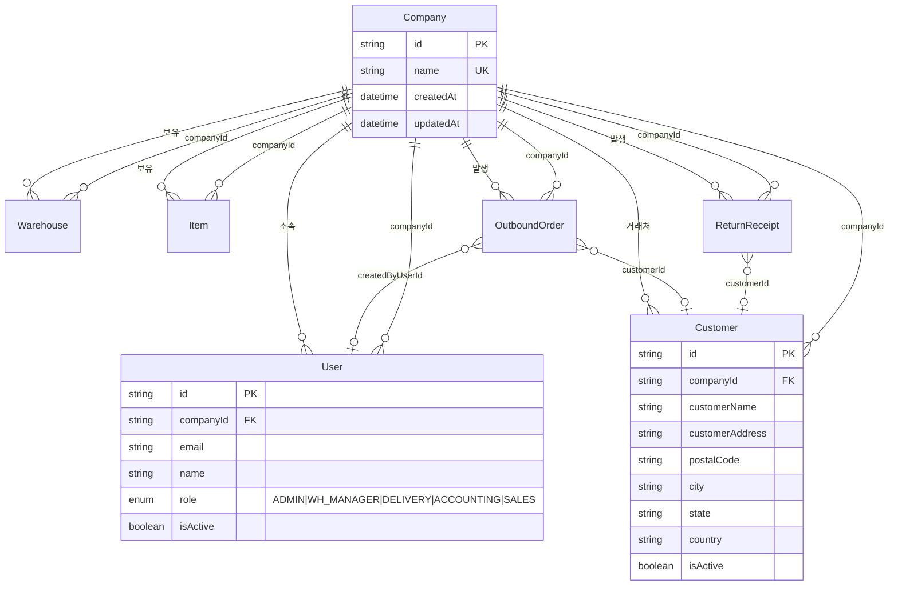

# WarehouseHub Prisma 스키마 분석 및 설계 제안

> **작성일**: 2025-03-04  
> **범위**: Company, User, Customer 중심 구조 분석  
> **코드 수정 없음** — 설계 문서 및 제안만 제시

---

## 1. 사용자 의도 vs 현재 구조 매칭 분석

### 1.1 "회사별 admin이 있을 것"

| 항목 | 현재 구조 | 부합 여부 |
|------|-----------|-----------|
| 회사별 admin 존재 | `User.role = ADMIN` 로 표현, 회사마다 1명 이상 ADMIN 가능 | ✅ **부합** |
| Admin 권한 범위 | Role enum 주석: "ADMIN: 회사 전체 관리자" | ✅ **부합** |
| 다중 Admin | 한 회사에 여러 User가 ADMIN일 수 있음 | ✅ **허용 (실용적)** |

**결론**: 현재 `User.role` 기반 설계로 "회사별 admin" 요구사항을 충족한다.

---

### 1.2 "회사와 거래하고 있는 고객사가 있을 것"

| 항목 | 현재 구조 | 부합 여부 |
|------|-----------|-----------|
| 고객사 정의 | `Customer.companyId → Company` (Company 소유) | ✅ **부합** |
| 거래 관계 | `OutboundOrder.customerId → Customer`, `ReturnReceipt.customerId → Customer` | ✅ **부합** |
| 도메인 의미 | Company = 플랫폼 이용 회사(테넌트), Customer = 그 회사의 거래처 | ✅ **명확** |

**결론**: Customer가 "회사와 거래하는 고객사"를 올바르게 표현하고 있다.

---

## 2. 전체 평가

| 요구사항 | 현재 구조 | 평가 |
|----------|-----------|------|
| 회사별 admin | User.role = ADMIN | ✅ 충족 |
| 거래 고객사 | Customer (companyId → Company) | ✅ 충족 |
| 테넌시 격리 | 모든 주요 엔티티에 companyId | ✅ 적용됨 |

**종합**: 현재 스키마는 사용자가 원하는 구조와 **의미적으로 부합**한다. 대규모 변경은 필요하지 않다.

---

## 3. 정리/개선 방안

### 3.1 엔티티 네이밍 (Company vs Tenant vs Organization)

| 후보 | 장점 | 단점 | 권장 |
|------|------|------|------|
| **Company** | 비즈니스 도메인에 맞음, 창고/물류 업계에서 직관적 | - | ✅ **유지 권장** |
| Tenant | 멀티테넌시 기술 용어로 명확 | 비즈니스 담당자에게 덜 직관적 | ❌ |
| Organization | 일반적으로 많이 사용 | 창고 도메인에서 다소 추상적 | △ 선택사항 |

**제안**: `Company` 유지. 이미 스키마 전반에서 일관되게 사용 중이며, "회사와 거래하는 고객사"라는 문맥과 잘 맞는다.

---

### 3.2 Admin: 별도 모델 vs User.role

| 방식 | 장점 | 단점 |
|------|------|------|
| **User.role (현재)** | 단일 모델로 RBAC 처리, 코드 단순, 권한 변경 용이 | Admin 전용 필드 추가 시 User 모델 비대해질 수 있음 |
| 별도 CompanyAdmin 모델 | Admin 전용 메타데이터/초대 로직 분리 가능 | 모델/관계 복잡, User와의 동기화 필요 |

**제안**: `User.role` 유지. 현재 요구사항 수준에서는 과한 설계다.  
향후 "플랫폼 슈퍼관리자(Company 무소속)" 또는 "Admin 초대·승인 워크플로우"가 필요해지면 그때 확장을 검토하는 것이 적절하다.

---

### 3.3 Customer와 Company의 관계·역할 명확화

| 개념 | 현재 모델 | 설명 |
|------|-----------|------|
| **Company** | 플랫폼 테넌트(이용 회사) | 창고를 보유하고, 출고·입고를 수행하는 주체 |
| **Customer** | Company의 거래처(고객사) | 출고 대상, 리턴 발생 고객 |
| **관계** | Customer N:1 Company | 한 Company가 여러 Customer(거래처)를 가짐 |

**제안**:  
- 주석 보강: `Customer` 모델에 `/// 회사(테넌트)의 거래처(고객사). 출고/리턴의 대상.` 와 같은 한 줄 추가를 권장.
- 중복 방지: 동일 회사 내 동일 고객사 중복 등록 방지를 위해 `customerCode` 또는 `@@unique([companyId, customerName])` 검토 (아래 4절).

---

## 4. 구체적인 스키마 변경 제안

### 4.1 선택적 개선 (필수 아님)

| 대상 | 제안 내용 | 우선순위 |
|------|-----------|----------|
| **Customer** | `customerCode` 추가, `@@unique([companyId, customerCode])` | 중 |
| **Customer** | `@@unique([companyId, customerName])` — 이름 기준 중복 방지 | 중 |
| **Company** | `slug` (URL/서브도메인용) | 낮 |
| **Company** | `isActive` (계정 정지/비활성화) | 낮 |

### 4.2 제안 스키마 변경 (선택 적용)

```prisma
// Customer 모델 개선 예시 (선택)
model Customer {
  id        String  @id @default(uuid())
  companyId String
  company   Company @relation(...)

  customerCode String?  // NEW: 내부 관리용 코드 (itemCode와 유사)
  customerName String
  customerAddress String
  // ... 기존 필드 ...

  // 기존 인덱스 유지
  @@unique([companyId, customerCode])  // NEW: customerCode 사용 시
  // 또는
  @@unique([companyId, customerName])  // 이름 기준 중복 방지 시
  @@index([companyId])
  @@index([customerName])
}
```

### 4.3 변경 불필요

- Company, User, Customer 핵심 관계와 Role 설계
- 테넌시 격리(companyId) 적용 방식
- OutboundOrder / ReturnReceipt와 Customer 연결 구조

---

## 5. ER 다이어그램 (핵심 관계)

### 5.1 Mermaid ER 다이어그램



### 5.2 핵심 관계 요약도

```
                    ┌─────────────┐
                    │   Company   │
                    │  (테넌트)   │
                    └──────┬──────┘
                           │
        ┌──────────────────┼──────────────────┐
        │                  │                  │
        ▼                  ▼                  ▼
   ┌─────────┐      ┌───────────┐      ┌──────────┐
   │  User   │      │ Customer  │      │Warehouse │
   │(role=   │      │ (고객사)  │      │  Item    │
   │ ADMIN   │      │           │      │  Lot     │
   │ 등)     │      │ companyId │      │  ...     │
   └────┬────┘      └─────┬─────┘      └──────────┘
        │                 │
        │                 │
        │            ┌────┴────┐
        │            ▼         ▼
        │     OutboundOrder  ReturnReceipt
        │     (출고 주문)    (반품 접수)
        │            │         │
        └────────────┴─────────┘
              (createdBy, deliveredBy 등)
```

### 5.3 관계 매트릭스

| 관계 | 카디널리티 | 설명 |
|------|------------|------|
| Company → User | 1:N | 한 회사에 여러 사용자 |
| Company → Customer | 1:N | 한 회사가 여러 거래처 보유 |
| Company → Warehouse | 1:N | 한 회사가 여러 창고 (현재 DRY/COOL/FRZ 각 1개) |
| Company → Item | 1:N | 한 회사가 여러 품목 |
| User → Company | N:1 | 사용자는 한 회사에만 소속 |
| Customer → Company | N:1 | 고객사는 한 회사(테넌트) 소유 |
| Customer → OutboundOrder | 1:N | 한 고객사에 여러 출고 주문 |
| Customer → ReturnReceipt | 1:N | 한 고객사에 여러 반품 접수 |

---

## 6. 결론 및 권장 액션

### 6.1 결론

- 현재 스키마는 **"회사별 admin"** 및 **"회사와 거래하는 고객사"** 요구사항을 **충족**한다.
- Company, User.role, Customer 관계는 **도메인 의도에 맞게** 설계되어 있다.
- **필수적인 스키마 변경은 없으며**, 선택적으로 Customer 중복 방지용 유니크 제약 등을 검토할 수 있다.

### 6.2 권장 액션 (우선순위)

| 순서 | 액션 | 비고 |
|------|------|------|
| 1 | **현재 구조 유지** | Company, User.role, Customer 관계 그대로 사용 |
| 2 | **Customer 주석 보강** | 모델 목적(거래처) 명시 |
| 3 | **(선택) Customer 중복 방지** | `customerCode` 또는 `customerName` unique 제약 검토 |
| 4 | **(선택) Company 확장** | slug, isActive 등 필요 시 추가 |

---

*문서 끝*
